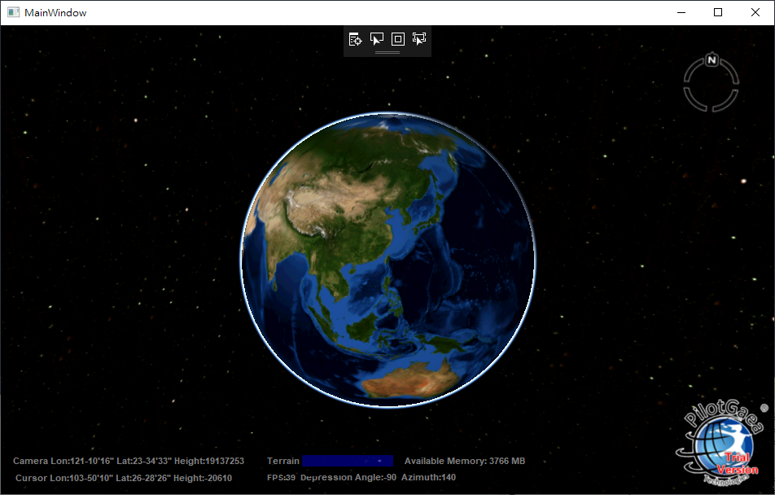

# OviewWPF

## 參考文章[逐步解說：在 WPF 中裝載 ActiveX 控制項](https://docs.microsoft.com/zh-tw/dotnet/framework/wpf/advanced/walkthrough-hosting-an-activex-control-in-wpf)

## 原始碼於[src](https://github.com/PilotGaea/OviewWPF/edit/master/src)

## 開發流程

1. 開啟visual studio 新增方案 -> WPF應用程式 -> 命名為OviewWPF
2. 於OviewWPF->右鍵->加入->新增項目->Windows Form -> 命名Form1.cs
3. 於工具箱將PGTerrainView Class 拉到Form1上，會自動參考
	+ AxUniverseLiteLib
	+ UniverseLiteLib
4. 手動加入 WindowsFormsIntegration 元件的參考，其名稱為 WindowsFormsIntegration。
4. 於MainWindow.xaml新增grid1
```
<Grid Name="grid1">
    
</Grid>
```
5. 於grid1的Loaded事件中撰寫
```
	private void Window_Loaded(object sender, RoutedEventArgs e)
	{
		// Create the interop host control.
		System.Windows.Forms.Integration.WindowsFormsHost host =
			new System.Windows.Forms.Integration.WindowsFormsHost();

		// Create the ActiveX control.
		AxUniverseLiteLib.AxPGTerrainView axTerrainView = new AxUniverseLiteLib.AxPGTerrainView();

		// Assign the ActiveX control as the host control's child.
		host.Child = axTerrainView;

		// Add the interop host control to the Grid
		// control's collection of child controls.
		this.grid1.Children.Add(host);

		// Open a .TDF file with the ActiveX control.
		axTerrainView.Project.Open(@"D:\GISFiles\PGEarth.TDF");
	}
```

6. 建置後運行


